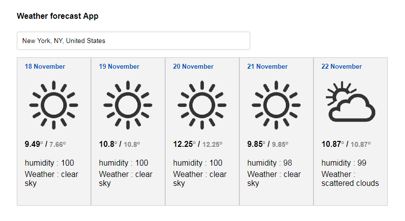

This is a very simple weather forecast system example developed using React and "Open weather API".

This web app has been developed using following technologies/api/libs
 - NPM
 - Webpack
 - React
 - react-grid-system (responsive layout)
 - Google autocomplete 
 - openweathermap (http://openweathermap.org/api)

To run the application, install dependencies defined in the package.json file then run the NPM START command. The application runs on http://localhost:8080/